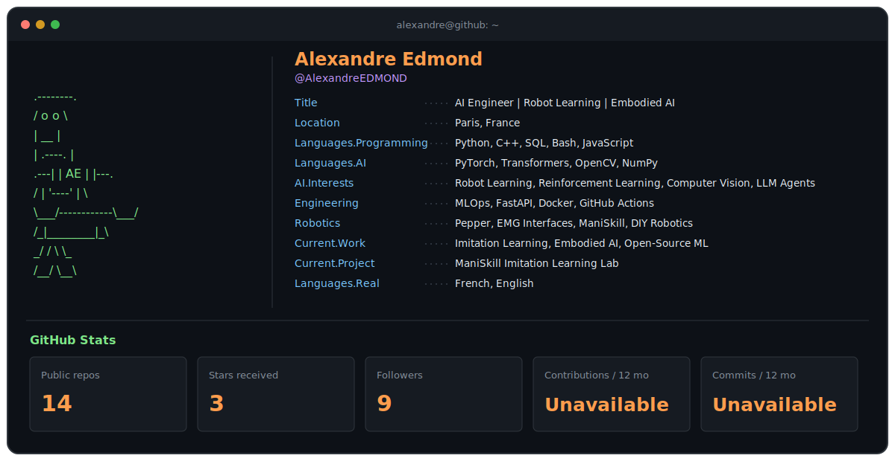

  <picture>
    <source media="(max-width: 600px)" srcset="./assets/profile-terminal-mobile.svg">
    
  </picture>

## About Me

I am an AI engineer in Paris working on robot learning, embodied AI, and practical machine-learning systems. My current focus is imitation learning with ManiSkill, alongside reinforcement learning, computer vision, and open-source ML tooling.

## Featured Projects

- **[ManiSkill Imitation Learning Lab](https://github.com/AlexandreEDMOND/Maniskill-Imitation-Learning-Lab)** - A behavior-cloning lab for ManiSkill PickCube-v1 built with PyTorch.
- **[numpy-rl-racer](https://github.com/AlexandreEDMOND/numpy-rl-racer)** - A NumPy-only DQN racing agent trained on procedurally generated 2D tracks.
- **[flechebench](https://github.com/AlexandreEDMOND/flechebench)** - A benchmark for evaluating language models on French arrowword puzzles.
- **[TonySpark](https://github.com/AlexandreEDMOND/TonySpark)** - A React gesture-control interface using webcam hand tracking and MediaPipe.
- **[zero_to_skyjo](https://github.com/AlexandreEDMOND/zero_to_skyjo)** - A reinforcement-learning agent that learns to play Skyjo from scratch.

## Technologies

- **AI and robotics:** PyTorch, Transformers, OpenCV, NumPy, ManiSkill, reinforcement learning, imitation learning
- **Engineering:** Python, C++, SQL, Bash, JavaScript, FastAPI, Docker, GitHub Actions

## Open Source Contributions

I explore accessible robot-learning workflows through my public **[LeRobot fork](https://github.com/AlexandreEDMOND/lerobot)** and developed **[TTS-GAN](https://github.com/AlexandreEDMOND/TTS-GAN)** as part of a collaborative time-series generation project with HagerGroup.

  

## Contact

Find my public work and current projects on **[GitHub](https://github.com/AlexandreEDMOND)**.
